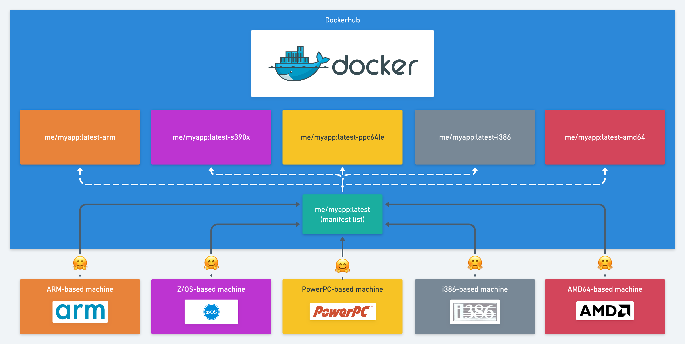

# kross

A simple CLI to "multi-arch all the things"

[](https://badge.fury.io/py/kross)
[](https://opensource.org/licenses/Apache-2.0)
[](https://pypi.org/project/kross/)
[](https://requires.io/github/pcorbel/kross/requirements/)
[]()
[](https://github.com/ambv/black)


# What is kross ?

kross is a tool to automate the build of Docker images for multiple architectures without any changes required on your code

# Quick start

* Install via pip

`pip install kross`

* Initialize it (once)

`kross init`

* Update your docker build commands

> Before

```
docker build -t me/myapp:vX.X.X ...args... path/to/docker/context
docker push me/myapp:vX.X.X
```

> After

```
kross build -t me/myapp:vX.X.X ...args... path/to/docker/context
kross push me/myapp:vX.X.X
```

# Why kross ?

Kross is born from a Raspberry Pi passionnate developer.
Because Raspberry Pi are arm-based and 90% of images on Dockerhub are amd64-based, developers have to duplicate/tweak all Dockerfiles so the image will work on it and avoid the too much popular `cannot execute binary file: Exec format error`.


# How kross is working ?

kross is based upon the [qemu library](https://www.qemu.org/) to build multiple architectures images on a amd64-based host machine.
After all images are built and pushed to a docker registry, a [manifest list](https://docs.docker.com/engine/reference/commandline/manifest/#create-and-push-a-manifest-list) is pushed too so that users can pull images based on their architectures in a seamless way.



# Supported architectures

kross will try to build images for the following architectures:

* amd64
* arm32v6
* arm32v7
* arm64v8
* ppc64le
* s390x
* i386

# Run the example

* Install kross
`pip install kross`

* Check your machine configuration
`kross init`

* Clone the project
`git clone https://github.com/pcorbel/kross.git`

* Go to the example directory
`cd kross/docs/example`

* Run the kross build
`kross build -t <your dockerhub id>/hello-world:v0.1.0 .`

* Run the kross push
`kross push <your dockerhub id>/hello-world:v0.1.0`

* Check images availability on your Dockerhub account

`https://cloud.docker.com/u/<your dockerhub id>/repository/docker/<your dockerhub id>/hello-world`
